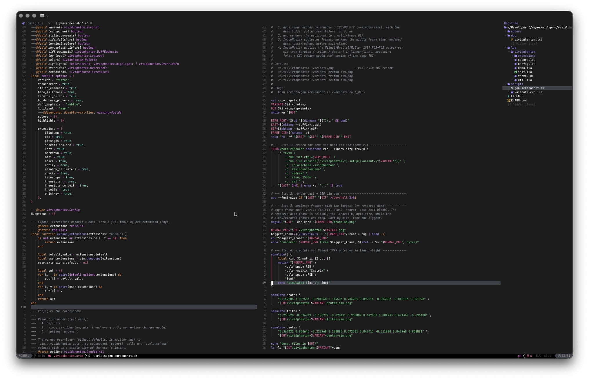
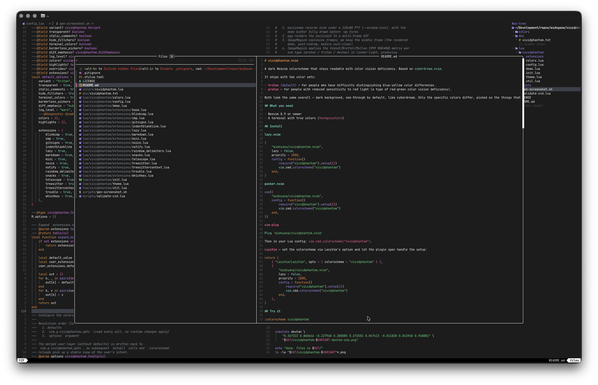

# vividphantom.nvim

A dark Neovim colorscheme that stays readable with color vision deficiency. Based on [cyberdream.nvim](https://github.com/scottmckendry/cyberdream.nvim).

It ships with two color sets:

- **`tritan`** *(default)* — for people who have difficulty distinguishing blue-yellow color differences.
- **`protan`** — for people with reduced sensitivity to red light (a type of red-green color vision deficiency).

Both look the same overall — dark background, see-through by default, like cyberdream. Only the specific colors differ, picked so the things that need to look different (errors vs warnings, added vs deleted lines, types vs keywords, etc.) actually do.

## What you need

- Neovim 0.9 or newer
- A terminal with true colors (`termguicolors`)

## Install

**[lazy.nvim](https://github.com/folke/lazy.nvim)**

```lua
{
    "widnyana/vividphantom.nvim",
    lazy = false,
    priority = 1000,
    config = function()
        require("vividphantom").setup({})
        vim.cmd.colorscheme("vividphantom")
    end,
}
```

**[packer.nvim](https://github.com/wbthomason/packer.nvim)**

```lua
use({
    "widnyana/vividphantom.nvim",
    config = function()
        require("vividphantom").setup({})
        vim.cmd.colorscheme("vividphantom")
    end,
})
```

**vim-plug**

```vim
Plug 'widnyana/vividphantom.nvim'
```

Then in your Lua config: `vim.cmd.colorscheme("vividphantom")`.

**LazyVim** — set the colorscheme via LazyVim's option and let the plugin spec handle the setup:

```lua
return {
    { "LazyVim/LazyVim", opts = { colorscheme = "vividphantom" } },
    {
        "widnyana/vividphantom.nvim",
        lazy = false,
        priority = 1000,
        config = function()
            require("vividphantom").setup({})
            vim.cmd.colorscheme("vividphantom")
        end,
    },
}
```

## Try it

```vim
:colorscheme vividphantom
```

That's the minimum. Everything below is optional.

## Pick a variant

Pick whichever matches the difficulty you actually have day-to-day, not what a clinic label says.

| If this sounds familiar…                                                            | Use     |
|--------------------------------------------------------------------------------------|---------|
| Reduced sensitivity to red light; reds look dim or near-black; red-green confusion    | `protan` |
| Difficulty distinguishing blues from yellows; cyan and green can look the same        | `tritan` |
| Not sure                                                                             | Try both — see [Preview](#preview) |

Switch with:

```lua
require("vividphantom").setup({ variant = "protan" })
```

## Options

Everything you can pass to `setup()`, with defaults:

```lua
require("vividphantom").setup({
    variant            = "tritan",   -- "tritan" | "protan"
    transparent        = true,       -- see-through background
    italic_comments    = true,       -- italics on comments
    hide_fillchars     = true,       -- hide ~ end-of-buffer + split borders
    terminal_colors    = true,       -- set the 16 terminal colors for :terminal
    borderless_pickers = true,       -- blend Telescope/Snacks pickers into one bg
    diff_emphasis      = "subtle",   -- "subtle" | "high" — diff line tint strength
    log_level          = "warn",     -- "off"|"error"|"warn"|"info"|"debug"|"trace"

    colors     = {},                 -- override individual palette colors
    highlights = {},                 -- override specific highlight groups
    overrides  = nil,                -- same as `highlights`, but as a function

    extensions = {                   -- per-plugin styling — all on by default
        blinkcmp = true, cmp = true, gitsigns = true, indentblankline = true,
        lazy = true, markdown = true, mini = true, noice = true,
        notify = true, rainbow_delimiters = true, snacks = true,
        telescope = true, treesitter = true, treesittercontext = true,
        trouble = true, whichkey = true,
    },
})
```

### What each option does

| Option                | What it does                                                                                              |
|-----------------------|------------------------------------------------------------------------------------------------------------|
| `variant`             | Which color set to use. `"tritan"` or `"protan"`.                                                          |
| `transparent`         | If `true`, the editor background is see-through (your terminal background shows through).                  |
| `italic_comments`     | Italics on comments. Needs a font that supports italics.                                                   |
| `hide_fillchars`      | Hides the `~` markers at the end of a buffer and the characters in split borders.                          |
| `terminal_colors`     | Sets the 16 ANSI colors `:terminal` uses to match the palette.                                             |
| `borderless_pickers`  | Telescope and Snacks pickers blend into a single background instead of drawing visible borders.            |
| `diff_emphasis`       | How strong the tint is on diff lines. `"subtle"` is the cyberdream look. `"high"` makes add/remove blocks pop more — recommended for `protan` if diffs feel washed out. |
| `log_level`           | How much the plugin says when something looks wrong. `"warn"` is sensible. `"off"` silences it.            |
| `colors`              | Replace specific palette colors. See [Tweak the colors](#tweak-the-colors).                                |
| `highlights`          | Replace specific highlight groups by name (a table) or build them from the palette (a function).           |
| `overrides`           | Function form of `highlights` — gives you the palette as an argument.                                     |
| `extensions`          | Turn styling on or off per plugin. Add `default = false` to turn everything off then re-enable a few.       |

## Common tweaks

**Solid background instead of see-through**

```lua
require("vividphantom").setup({ transparent = false })
```

**No italic comments**

```lua
require("vividphantom").setup({ italic_comments = false })
```

**Stronger diff tints** *(handy for `protan` — `git diff` blocks pop more)*

```lua
require("vividphantom").setup({
    variant       = "protan",
    diff_emphasis = "high",
})
```

**Only style a few plugins** — turn everything off, re-enable what you use:

```lua
require("vividphantom").setup({
    extensions = {
        default = false,
        treesitter = true,
        gitsigns = true,
        snacks = true,
    },
})
```

## Tweak the colors

Replace one or more palette colors:

```lua
require("vividphantom").setup({
    colors = {
        red  = "#ff5050",
        cyan = "#7ee8e8",
    },
})
```

Replace specific highlight groups by name:

```lua
require("vividphantom").setup({
    highlights = {
        Comment       = { fg = "#777777", italic = false },
        ["@variable"] = { bold = true },
    },
})
```

Or build them from the palette via a function:

```lua
require("vividphantom").setup({
    overrides = function(t)
        return {
            Comment    = { fg = t.cyan, italic = true },
            CursorLine = { bg = t.bg_highlight },
        }
    end,
})
```

The palette `t` exposes:

`bg`, `bg_alt`, `bg_highlight`, `bg_solid`, `fg`, `grey`, `blue`, `green`, `cyan`, `red`, `yellow`, `magenta`, `pink`, `orange`, `purple`.

> `bg_solid` is the real dark background even when `transparent = true`. Use it as a foreground when you need dark text on a colored background — that way it stays readable when the rest of the bg goes see-through.

## Configure without `setup()`

If you'd rather set things in your config than call a function, put them in `vim.g.vividphantom_opts` before the colorscheme loads:

```lua
vim.g.vividphantom_opts = {
    variant     = "protan",
    transparent = false,
}
vim.cmd.colorscheme("vividphantom")
```

If you set both, `setup()` arguments win over `vim.g.vividphantom_opts`, which wins over defaults.

## Preview





Open a temporary buffer that shows every color and group at once:

```vim
:VividphantomDemo
```

Useful for taking a screenshot and feeding it into a color vision deficiency (CVD) simulator like [Color Oracle](https://colororacle.org/) or [coblis](https://www.color-blindness.com/coblis-color-blindness-simulator/) to check it actually holds up for you specifically.

## Plugins this styles

| Plugin                                  | Extension key         |
|-----------------------------------------|-----------------------|
| Treesitter                              | `treesitter`          |
| Treesitter Context                      | `treesittercontext`   |
| Telescope                               | `telescope`           |
| nvim-cmp                                | `cmp`                 |
| blink.cmp                               | `blinkcmp`            |
| Gitsigns                                | `gitsigns`            |
| Lazy                                    | `lazy`                |
| Noice                                   | `noice`               |
| nvim-notify                             | `notify`              |
| Snacks (picker, dashboard, notifier)    | `snacks`              |
| WhichKey                                | `whichkey`            |
| Trouble                                 | `trouble`             |
| IndentBlankline                         | `indentblankline`     |
| Rainbow Delimiters                      | `rainbow_delimiters`  |
| mini.nvim suite                         | `mini`                |
| render-markdown.nvim                    | `markdown`            |

LSP and diagnostic colors plus standard Vim syntax are always styled — those can't be turned off.

## Something's off

**`:colorscheme vividphantom` does nothing.** Check `~/.config/nvim/colors/`. If there's an old `vividphantom.lua.bak` or any sibling file with "vividphantom" in the name, Neovim's loader can get confused even when the extension isn't `.lua`. Move it out.

**Search highlights are unreadable.** You're on an old version. Update — recent ones keep the search text dark on the highlight bg even when transparency is on.

**Pickers look fully transparent.** That's the default when `transparent = true`. Turn off transparency, or turn off picker styling specifically:

```lua
require("vividphantom").setup({ borderless_pickers = false })
```

**Comments aren't italic.** Your terminal or font doesn't render italics. Try a font that ships italics (JetBrains Mono, Cascadia Code, Iosevka, Fira Code), or just turn italics off:

```lua
require("vividphantom").setup({ italic_comments = false })
```

## Credits

Based on [cyberdream.nvim](https://github.com/scottmckendry/cyberdream.nvim) by Scott McKendry. The look and the plugin layout come from there; this fork adjusts the palettes for readers with color vision deficiency.

## License

MIT. See [LICENSE](LICENSE).
